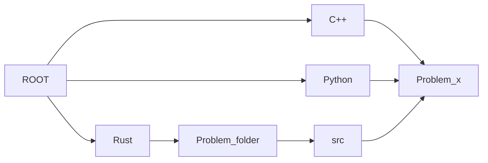

# LeetCode

Solutions for LeetCode in C++, Python, and Rust.

A quick note: I'm learning Rust with this.

## Project structure

```mermaid
graph LR;
    ROOT-->C++
    ROOT-->Python
    ROOT-->Rust
    C++-->Problem_x
    Python-->Problem_x
    Rust-->Problem_folder
    Problem_folder-->src
    src-->Problem_x
```
