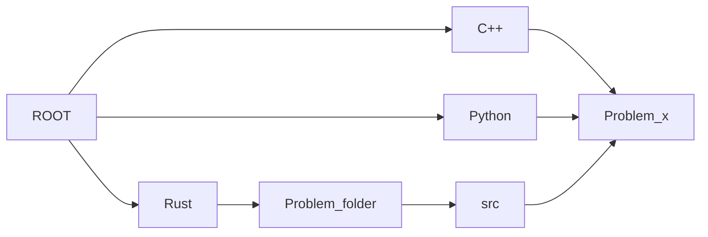

# LeetCode

Solutions for LeetCode in C++, Python, and Rust.

A quick note: I'm learning Rust with this.

## Project structure



## Gantt Chart

### LeetCode 75

<!-- title : (empyty|active|done) , name , after name , 1d -->
```mermaid
gantt
    section Array/Str
    Merge Strings Alternately               : done,   a0, 2000-01-01, 1d
    Greatest Common Divisor of Strings      : done,   a,  2000-01-01, 1d
    Kids With the Greatest Number of Candies: active, a,  2000-01-01, 1d
    Can Place Flowers                       :         a,  2000-01-01, 1d
    Reverse Vowels of a String              :         a,  2000-01-01, 1d
    Reverse Words in a String               :         a,  2000-01-01, 1d
    Product of Array Except Self            :         a,  2000-01-01, 1d
    Increasing Triplet Subsequence          :         a,  2000-01-01, 1d
    String Compression                      :         a,  2000-01-01, 1d

    section Two Pointers
    Move Zeroes              :         a1, after a0, 1d
    Is Subsequence           :         a , after a0, 1d
    Container With Most Water:         a , after a0, 1d
    Max Number of K-Sum Pairs:         a , after a0, 1d

    # section LeetCode 75 Sliding Window
    # Merge Strings Alternately:         a0, 2000-01-01, 1d
    # Merge Strings Alternately:         a0, 2000-01-01, 1d
    # Merge Strings Alternately:         a0, 2000-01-01, 1d
    # Merge Strings Alternately:         a0, 2000-01-01, 1d

    # section LeetCode 75 Prefix Sum
    # Merge Strings Alternately:         a0, 2000-01-01, 1d
    # Merge Strings Alternately:         a0, 2000-01-01, 1d

    # section LeetCode 75 To categorize
    # Merge Strings Alternately:         a0, 2000-01-01, 1d
    # Merge Strings Alternately:         a0, 2000-01-01, 1d
    # Merge Strings Alternately:         a0, 2000-01-01, 1d
    # Merge Strings Alternately:         a0, 2000-01-01, 1d
    # Merge Strings Alternately:         a0, 2000-01-01, 1d
    # Merge Strings Alternately:         a0, 2000-01-01, 1d
    # Merge Strings Alternately:         a0, 2000-01-01, 1d
    # Merge Strings Alternately:         a0, 2000-01-01, 1d
    # Merge Strings Alternately:         a0, 2000-01-01, 1d
    # Merge Strings Alternately:         a0, 2000-01-01, 1d
    # Merge Strings Alternately:         a0, 2000-01-01, 1d
    # Merge Strings Alternately:         a0, 2000-01-01, 1d
    # Merge Strings Alternately:         a0, 2000-01-01, 1d
    # Merge Strings Alternately:         a0, 2000-01-01, 1d
    # Merge Strings Alternately:         a0, 2000-01-01, 1d
    # Merge Strings Alternately:         a0, 2000-01-01, 1d
    # Merge Strings Alternately:         a0, 2000-01-01, 1d
    # Merge Strings Alternately:         a0, 2000-01-01, 1d
    # Merge Strings Alternately:         a0, 2000-01-01, 1d
    # Merge Strings Alternately:         a0, 2000-01-01, 1d
    # Merge Strings Alternately:         a0, 2000-01-01, 1d
    # Merge Strings Alternately:         a0, 2000-01-01, 1d
    # Merge Strings Alternately:         a0, 2000-01-01, 1d
    # Merge Strings Alternately:         a0, 2000-01-01, 1d
    # Merge Strings Alternately:         a0, 2000-01-01, 1d
    # Merge Strings Alternately:         a0, 2000-01-01, 1d
    # Merge Strings Alternately:         a0, 2000-01-01, 1d
    # Merge Strings Alternately:         a0, 2000-01-01, 1d
    # Merge Strings Alternately:         a0, 2000-01-01, 1d
    # Merge Strings Alternately:         a0, 2000-01-01, 1d
    # Merge Strings Alternately:         a0, 2000-01-01, 1d
    # Merge Strings Alternately:         a0, 2000-01-01, 1d
    # Merge Strings Alternately:         a0, 2000-01-01, 1d
    # Merge Strings Alternately:         a0, 2000-01-01, 1d
    # Merge Strings Alternately:         a0, 2000-01-01, 1d
    # Merge Strings Alternately:         a0, 2000-01-01, 1d
    # Merge Strings Alternately:         a0, 2000-01-01, 1d
    # Merge Strings Alternately:         a0, 2000-01-01, 1d
    # Merge Strings Alternately:         a0, 2000-01-01, 1d
    # Merge Strings Alternately:         a0, 2000-01-01, 1d
    # Merge Strings Alternately:         a0, 2000-01-01, 1d
    # Merge Strings Alternately:         a0, 2000-01-01, 1d
    # Merge Strings Alternately:         a0, 2000-01-01, 1d
    # Merge Strings Alternately:         a0, 2000-01-01, 1d
    # Merge Strings Alternately:         a0, 2000-01-01, 1d
    # Merge Strings Alternately:         a0, 2000-01-01, 1d
    # Merge Strings Alternately:         a0, 2000-01-01, 1d
    # Merge Strings Alternately:         a0, 2000-01-01, 1d
    # Merge Strings Alternately:         a0, 2000-01-01, 1d
    # Merge Strings Alternately:         a0, 2000-01-01, 1d
    # Merge Strings Alternately:         a0, 2000-01-01, 1d
    # Merge Strings Alternately:         a0, 2000-01-01, 1d
    # Merge Strings Alternately:         a0, 2000-01-01, 1d
    # Merge Strings Alternately:         a0, 2000-01-01, 1d
    # Merge Strings Alternately:         a0, 2000-01-01, 1d
    # Merge Strings Alternately:         a0, 2000-01-01, 1d
```
