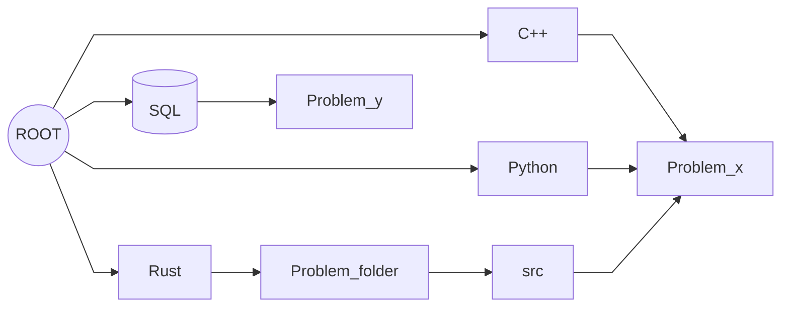
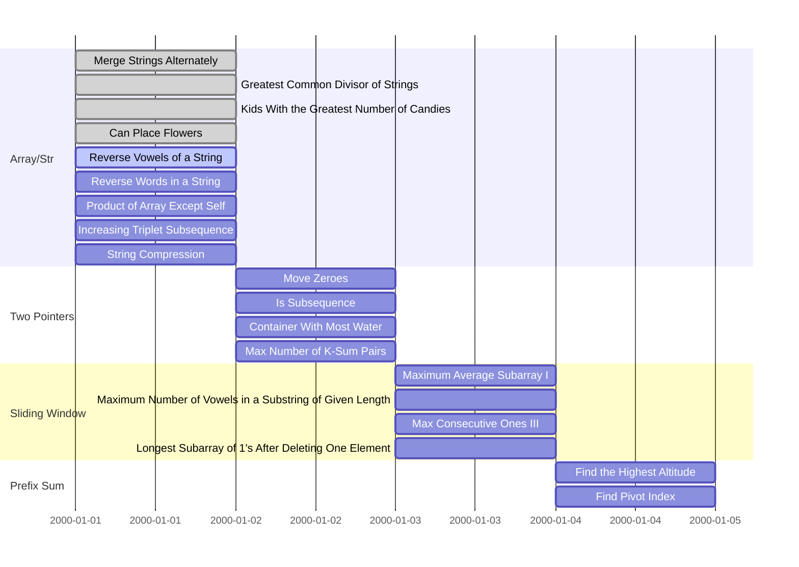
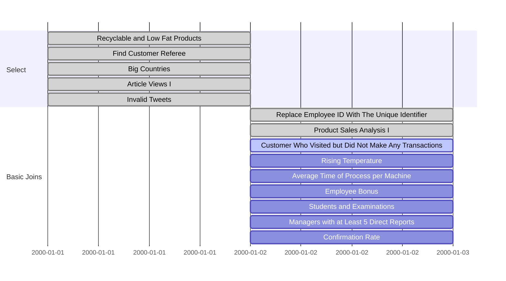

# LeetCode

Solutions for LeetCode in C++, Python, and Rust.

A quick note: I'm learning Rust with this.

## Project structure

Click to expand!

## Gantt Chart

### LeetCode 75

Click to expand!

<!-- title : (empty|active|done) , name , after name , 1d -->

### SQL 50

Click to expand!

