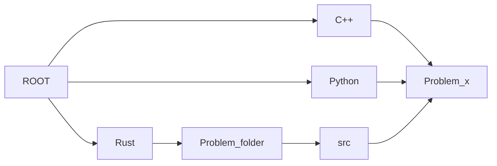

# LeetCode

Solutions for LeetCode in C++, Python, and Rust.

A quick note: I'm learning Rust with this.

## Project structure



## Gantt Chart

<!-- title : (empyty|active|done) , name , after name , 1d -->
```mermaid
gantt
    section LeetCode 75 Array/String
    Merge Strings Alternately               : done,   a0, 2000-01-01, 1d
    Greatest Common Divisor of Strings      :         a1, after a0, 1d
    Kids With the Greatest Number of Candies:         a2, after a1, 1d
    Can Place Flowers                       :         a3, after a2, 1d
    Reverse Vowels of a String              :         a4, after a3, 1d
    Reverse Words in a String               :         a5, after a4, 1d
    Product of Array Except Self            :         a6, after a5, 1d
    Increasing Triplet Subsequence          :         a7, after a6, 1d
    String Compression                      :         a8, after a7, 1d

    section LeetCode 75 Two Pointers
    Move Zeroes              :         a9 , after a8 , 1d
    Is Subsequence           :         a10, after a9 , 1d
    Container With Most Water:         a11, after a10, 1d
    Max Number of K-Sum Pairs:         a12, after a11, 1d

    # section LeetCode 75 Sliding Window
    # Merge Strings Alternately:         a0, 2000-01-01, 1d
    # Merge Strings Alternately:         a0, 2000-01-01, 1d
    # Merge Strings Alternately:         a0, 2000-01-01, 1d
    # Merge Strings Alternately:         a0, 2000-01-01, 1d

    # section LeetCode 75 Prefix Sum
    # Merge Strings Alternately:         a0, 2000-01-01, 1d
    # Merge Strings Alternately:         a0, 2000-01-01, 1d

    # section LeetCode 75 To categorize
    # Merge Strings Alternately:         a0, 2000-01-01, 1d
    # Merge Strings Alternately:         a0, 2000-01-01, 1d
    # Merge Strings Alternately:         a0, 2000-01-01, 1d
    # Merge Strings Alternately:         a0, 2000-01-01, 1d
    # Merge Strings Alternately:         a0, 2000-01-01, 1d
    # Merge Strings Alternately:         a0, 2000-01-01, 1d
    # Merge Strings Alternately:         a0, 2000-01-01, 1d
    # Merge Strings Alternately:         a0, 2000-01-01, 1d
    # Merge Strings Alternately:         a0, 2000-01-01, 1d
    # Merge Strings Alternately:         a0, 2000-01-01, 1d
    # Merge Strings Alternately:         a0, 2000-01-01, 1d
    # Merge Strings Alternately:         a0, 2000-01-01, 1d
    # Merge Strings Alternately:         a0, 2000-01-01, 1d
    # Merge Strings Alternately:         a0, 2000-01-01, 1d
    # Merge Strings Alternately:         a0, 2000-01-01, 1d
    # Merge Strings Alternately:         a0, 2000-01-01, 1d
    # Merge Strings Alternately:         a0, 2000-01-01, 1d
    # Merge Strings Alternately:         a0, 2000-01-01, 1d
    # Merge Strings Alternately:         a0, 2000-01-01, 1d
    # Merge Strings Alternately:         a0, 2000-01-01, 1d
    # Merge Strings Alternately:         a0, 2000-01-01, 1d
    # Merge Strings Alternately:         a0, 2000-01-01, 1d
    # Merge Strings Alternately:         a0, 2000-01-01, 1d
    # Merge Strings Alternately:         a0, 2000-01-01, 1d
    # Merge Strings Alternately:         a0, 2000-01-01, 1d
    # Merge Strings Alternately:         a0, 2000-01-01, 1d
    # Merge Strings Alternately:         a0, 2000-01-01, 1d
    # Merge Strings Alternately:         a0, 2000-01-01, 1d
    # Merge Strings Alternately:         a0, 2000-01-01, 1d
    # Merge Strings Alternately:         a0, 2000-01-01, 1d
    # Merge Strings Alternately:         a0, 2000-01-01, 1d
    # Merge Strings Alternately:         a0, 2000-01-01, 1d
    # Merge Strings Alternately:         a0, 2000-01-01, 1d
    # Merge Strings Alternately:         a0, 2000-01-01, 1d
    # Merge Strings Alternately:         a0, 2000-01-01, 1d
    # Merge Strings Alternately:         a0, 2000-01-01, 1d
    # Merge Strings Alternately:         a0, 2000-01-01, 1d
    # Merge Strings Alternately:         a0, 2000-01-01, 1d
    # Merge Strings Alternately:         a0, 2000-01-01, 1d
    # Merge Strings Alternately:         a0, 2000-01-01, 1d
    # Merge Strings Alternately:         a0, 2000-01-01, 1d
    # Merge Strings Alternately:         a0, 2000-01-01, 1d
    # Merge Strings Alternately:         a0, 2000-01-01, 1d
    # Merge Strings Alternately:         a0, 2000-01-01, 1d
    # Merge Strings Alternately:         a0, 2000-01-01, 1d
    # Merge Strings Alternately:         a0, 2000-01-01, 1d
    # Merge Strings Alternately:         a0, 2000-01-01, 1d
    # Merge Strings Alternately:         a0, 2000-01-01, 1d
    # Merge Strings Alternately:         a0, 2000-01-01, 1d
    # Merge Strings Alternately:         a0, 2000-01-01, 1d
    # Merge Strings Alternately:         a0, 2000-01-01, 1d
    # Merge Strings Alternately:         a0, 2000-01-01, 1d
    # Merge Strings Alternately:         a0, 2000-01-01, 1d
    # Merge Strings Alternately:         a0, 2000-01-01, 1d
    # Merge Strings Alternately:         a0, 2000-01-01, 1d
    # Merge Strings Alternately:         a0, 2000-01-01, 1d
```
